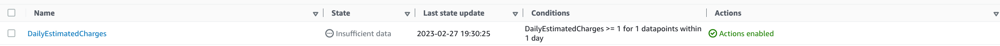
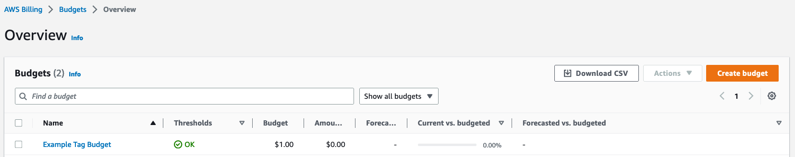

# Week 0 — Billing and Architecture

- [Week 0 — Billing and Architecture](#week-0--billing-and-architecture)
  - [Homework](#homework)
    - [To-do Checklist](#to-do-checklist)
    - [Install AWS CLI](#install-aws-cli)
    - [Create a new User and Generate AWS Credentials](#create-a-new-user-and-generate-aws-credentials)
    - [Set Env Vars](#set-env-vars)
    - [Check that the AWS CLI is working and you are the expected user](#check-that-the-aws-cli-is-working-and-you-are-the-expected-user)
    - [Enable Billing](#enable-billing)
    - [Create SNS Topic](#create-sns-topic)
    - [Create Alarm](#create-alarm)
    - [Create an AWS Budget](#create-an-aws-budget)
  - [Homework Challenges](#homework-challenges)

## Homework

### To-do Checklist

- [x] Watched Week 0 - Live Stream Video - [Video](https://www.youtube.com/live/SG8blanhAOg?feature=share)
- [x] Watched Chirag's Week 0 - Spend Considerations - [Video](https://youtu.be/OVw3RrlP-sI)
- [x] Watched Ashish's Week 0 - Security Considerations - [Video](https://youtu.be/4EMWBYVggQI)
- [ ] Recreate Conceptual Diagram in Lucid Charts - [Link](.) - (Pending)
- [ ] Recreate Logical Architectual Diagram in Luci Charts - [Link](.) - (Pending)
- [x] Create an Admin User
- [x] Use Cloudshell
- [x] Generate AWS Credentials
- [x] Install AWS CLI
- [x] Create a Billing Alarm
- [x] Create a Budget

### Install AWS CLI

In order to use AWS CLI with Gitpod we'll do the below:

- Install the AWS CLI when our Gitpod environment launches
- Update our `.gitpod.yml` file to automate the AWS CLI installation
- Test the automation works as expected

Update the `.gitpod.yml` file to include the following task.

```yml
tasks:
  - name: aws-cli
    env:
      AWS_CLI_AUTO_PROMPT: on-partial
    init: |
      cd /workspace
      curl "https://awscli.amazonaws.com/awscli-exe-linux-x86_64.zip" -o "awscliv2.zip"
      unzip awscliv2.zip
      sudo ./aws/install
      cd $THEIA_WORKSPACE_ROOT
```

With the above code, we'll ensure the AWS CLI installer is downloaded outside our repository, on `/workspace` so we don't add it to our GitHub repo.

### Create a new User and Generate AWS Credentials

In order to create a new IAM user, we can follow these [steps](https://docs.aws.amazon.com/IAM/latest/UserGuide/id_users_create.html) from the AWS Documentation website and get familiar with the official AWS resources.

Once the IAM user is created, we can follow the below steps to generate the Access Keys:

- Open the `IAM console`
- In the navigation pane, choose `Users`
- Choose the name of the user whose access keys you want to create
- On the summary page of the user, choose the `Security Credentials` tab
- In the `Access Keys` section, choose `Create access key`. Select `Show` to view the new access key pair
- You can also `Download .csv file` and store the keys in a secure location
  
### Set Env Vars

We will set these credentials for the current sh terminal

```sh
export AWS_ACCESS_KEY_ID=""
export AWS_SECRET_ACCESS_KEY=""
export AWS_DEFAULT_REGION=us-east-1
```

You can ensure the Environment Variables are saved by searching using the following command

```sh
grep | env AWS
```

We'll tell Gitpod to remember these credentials if we relaunch our workspaces

```sh
gp env AWS_ACCESS_KEY_ID=""
gp env AWS_SECRET_ACCESS_KEY=""
gp env AWS_DEFAULT_REGION=us-east-1
```

### Check that the AWS CLI is working and you are the expected user

Use the following commnad to get your account ID using AWS CLI.

```sh
aws sts get-caller-identity
```

It will show something liek this:

```json
{
    "UserId": "AIDA6FVUREK4GJANRAH6S",
    "Account": "974262444728",
    "Arn": "arn:aws:iam::974262444728:user/iamadmin"
}
```

### Enable Billing

- In your Root Account go to the [Billing Page](https://console.aws.amazon.com/billing/)
- Under `Billing Preferences` Choose `Receive Billing Alerts`
- Save Prefrences

### Create SNS Topic

We have to create an SNS topic before we create an alarm. The SNS topic will send an alert when we get over the alarm threshold. More info [here](https://docs.aws.amazon.com/cli/latest/reference/sns/create-topic.html).

Run the following command to create an SNS Topic

```sh
aws sns create-topic --name billing-alarm
```

This will return a TopicArn. Make a note of this.

We'll create a subscription providing the TopicARN and our preferred Email address for notifications

```sh
aws sns subscribe \
    --topic-arn TopicARN \
    --protocol email \
    --notification-endpoint your@email.com
```

Check your email and confirm the subscription


### Create Alarm

How can I monitor daily EstimatedCharges and trigger an Amazon CloudWatch alarm based on my usage threshold?

We need to update the configuration json script stored on `/aws/json/alarm_config.json` with the TopicArn we generated earlier.

Once it's ready, run the following command

```sh
aws cloudwatch put-metric-alarm --cli-input-json file://aws/json/alarm_config.json
```

We are just a json file because --metrics is is required for expressions and so its easier to us a JSON file.


**Resources:**

- [Create and alarm via AWS CLI](https://aws.amazon.com/premiumsupport/knowledge-center/cloudwatch-estimatedcharges-alarm/)
- [aws cloudwatch put-metric-alarm](https://docs.aws.amazon.com/cli/latest/reference/cloudwatch/put-metric-alarm.html)

### Create an AWS Budget

Get your AWS account ID

```sh
aws sts get-caller-identity --query Account --output text
```

Update the `/aws/json/budget.json/` file with the desired budget amount

Run the following command, updating the AccountID generated earlier

```sh
aws budgets create-budget \
    --account-id AccountID \
    --budget file://aws/json/budget.json \
    --notifications-with-subscribers file://aws/json/budget-notifications-with-subscribers.json
```



**Resources:**

- [aws budgets create-budget](https://docs.aws.amazon.com/cli/latest/reference/budgets/create-budget.html)

## Homework Challenges
